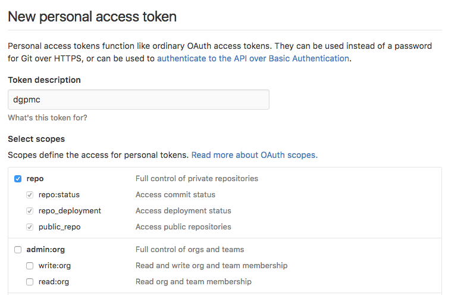

<!-- README.md is generated from README.Rmd. Please edit that file -->

```{r, echo = FALSE}
knitr::opts_chunk$set(
  collapse = TRUE,
  comment = "#>",
  fig.path = "README-"
)
```
# dgpmc

dgpmc (Data Generation Process Monte Carlo) is a package designed as a thin wrapper for performing Monte Carlo simulations on statistical functions and random data.

## Installation

The easiest way to install the package is via devtools. First, run the following code in the RStudio console:
```
install.packages('devtools')
```

Once devtools is installed, go get a personal API key [here](https://github.com/settings/tokens).  The page will look like the screenshots below. Select "Generate new token" then you may need to input your password.

<kbd></kbd>

When you're on the screen below, you'll need to give your token a description (it does not need to be "dgpmc"). Also make sure the "repo" option is selected, like below.

<kbd></kbd>

Finally, make sure you copy the new API token before closing the page, or else you'll need to re-generate it.

Once you've got your API token, run the code below in the RStudio console, replacing YOUR_AUTH_TOKEN with the token you just generated.

```
devtools::install_github(repo = 'scottmcneil/wildclusterbootsim', auth_token = 'YOUR_AUTH_TOKEN')

```


## Usage

This package contains just one function for running Monte Carlo simulations, `dgpmc`. The function has five required arguments and two optional arguments.

The five required arguments are:

Argument | Description
-------- | ------------------------------------------
`reps`   | The number of total Monte Carlo replications
`stat_func`   | A function that will take data and return a vector of statistics
`stat_args`   | A list of additional arguments to pass to `stat_func`
`rand_func`   | A function that will generate random data to pass to `stat_func`
`rand_args`   | A list of arguments to pass to `rand_func`

The two optional arguments are:

Argument | Description
-------- | ------------------------------------------
`names`   | Names to identify each element of the vector returned by `stat_func`
`progbar`   | A boolean indicating whether or not to display a progress bar

For each replication, `dgpmc` will run `rand_func` with the elements of `rand_args` as parameters. It will then pass the resulting data and the elements of `stat_args` to `stat_func`. The results of all the replications will be combined into an R datframe with `rep` rows and a column for each statistic and columns named using `names`.

The function returns a list, where the `stat` element contains the dataframe of results. The other elements in the list are the supplied `stat_func`, `stat_args`, `rand_func` and `rand_args`.


## Example

Below is an example of usage with very simple examples for `stat_func` and `rand_func`.

```

stat_func <- function(data, formula, x_interest, H0){

  #Create linear model based on data and formula
  model <- lm(data = data, formula = formula)

  #Extract coefficient of x of interest
  x_coef <- coef(model)[[x_interest]]

  #Extract standard error of x of interest
  x_se <- sqrt(diag(vcov(model)))[[x_interest]]

  #Return vectorized hypothesis test on vector of H0
  2*pt(abs(x_coef - H0)/x_se, df = df.residual(model), lower.tail = FALSE)

}

rand_func <- function(n, coef){

  #Create x vector of random normal variables
  x <- rnorm(n)
  
  #Create y vector correlated to x vecto
  y <- rnorm(n) + coef*x
  
  #Return dataframe of combined observations
  data.frame(y, x)

}

stat_args <- list(formula = y ~ x, x_interest = 'x', H0 = c(0.8, 1, 1.2))
rand_args <- list(n = 10, coef = 1)
reps <- 8
stat_names <- c('H01', 'H02', 'H03')

mc_results <- dgpmc(reps = reps, stat_func = stat_func, stat_args = stat_args, rand_func = rand_func, rand_args = rand_args, names = statnames)

print(mc_results$stat)

```

Will produce the following table:


```{r, echo=FALSE, message=FALSE}

stat_func <- function(data, formula, x_interest, H0){

  #Create linear model based on data and formula
  model <- lm(data = data, formula = formula)

  #Extract coefficient of x of interest
  x_coef <- coef(model)[[x_interest]]

  #Extract standard error of x of interest
  x_se <- sqrt(diag(vcov(model)))[[x_interest]]

  #Return vectorized hypothesis test on vector of H0
  2*pt(abs(x_coef - H0)/x_se, df = df.residual(model), lower.tail = FALSE)

}

rand_func <- function(n, coef){

  #Create x vector of random normal variables
  x <- rnorm(n)
  
  #Create y vector correlated to x vecto
  y <- rnorm(n) + coef*x
  
  #Return dataframe of combined observations
  data.frame(y, x)

}

stat_args <- list(formula = y ~ x, x_interest = 'x', H0 = c(0.8, 1, 1.2))
rand_args <- list(n = 10, coef = 1)
reps <- 8
stat_names <- c('H01', 'H02', 'H03')

set.seed(42)
mc_results <- dgpmc::dgpmc(reps = reps, stat_func = stat_func, stat_args = stat_args, rand_func = rand_func, rand_args = rand_args, names = stat_names)

knitr::kable(mc_results$stat, format = 'markdown')

```


## Built-in DGP functions

This library currently has two built-in DGP functions:

* `simple_dgp` creates a random normal data clusterd by group
* `autocorr_dgp` creates auto-correlated random data, clustered by both time and group
